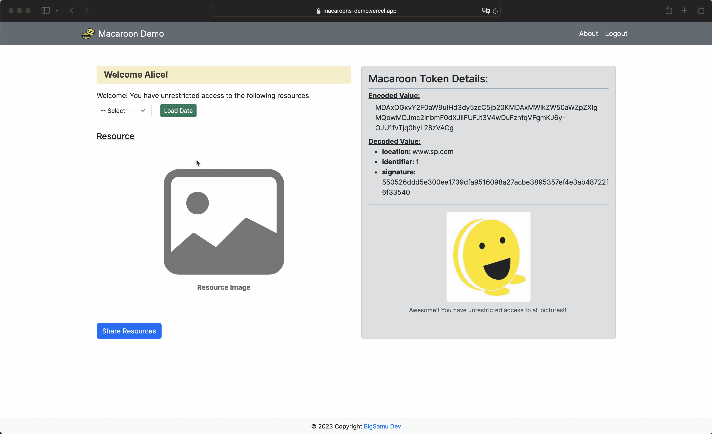
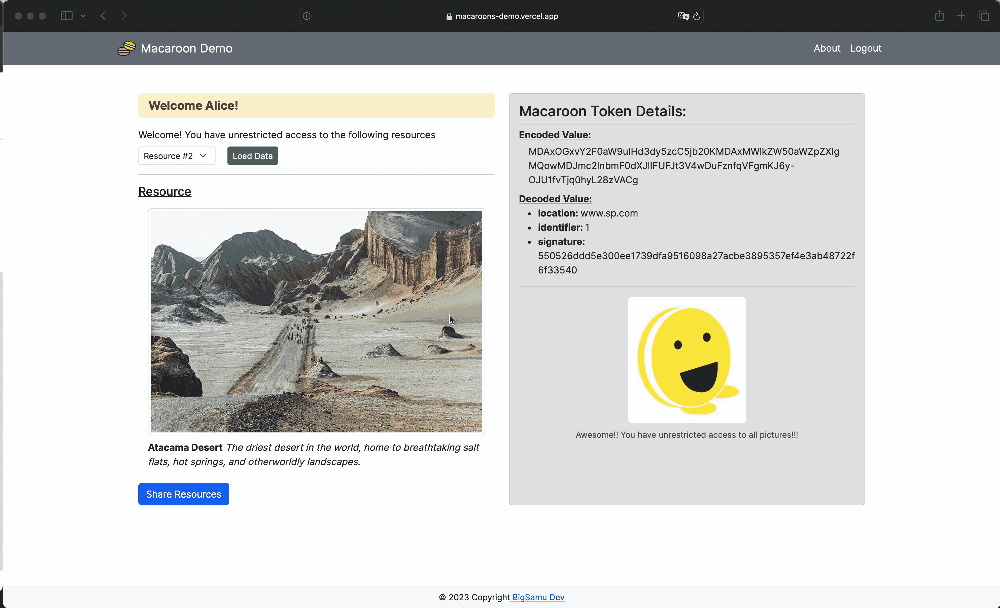
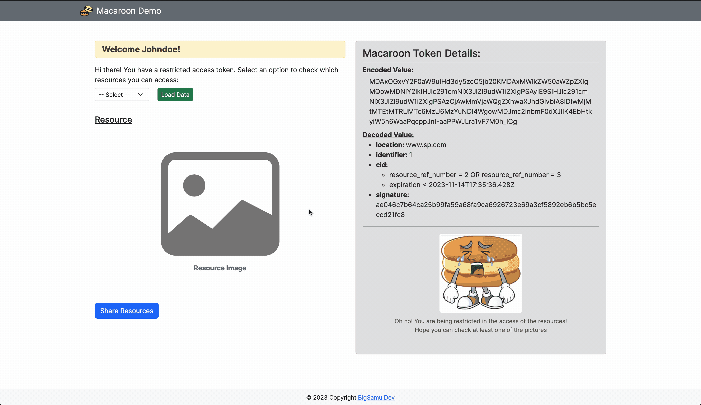

<a name="back-to-top"></a>

<!-- *********************************************************************** -->
<!-- 0.1) INTRO SHIELDS -->
<!-- *********************************************************************** -->

[![Github Follow][github-follow-badge]][github-follow-url]
[![License][license-badge]][license-url]
[![Forks][forks-badge]][forks-url]
[![Stars][stars-badge]][stars-url]
[![Watchers][watchers-badge]][watchers-url]
[![Ask Me Anything][ama-badge]][ama-url]
[![Say Thanks!][say-thanks-badge]][say-thanks-url]

[![Gmail Small][gmail-badge-small]][gmail-url]
[![LinkedIn Small][linkedin-badge-small]][linkedin-url]
[![Hackerrank Small][hackerrank-badge-small]][linkedin-url]
<!-- *********************************************************************** -->
<!-- 0.3) PROJECT TITLE -->
<!-- *********************************************************************** -->

<!-- omit in toc -->

# Macaroons Demo

A demo of macaroon tokens, credentials with contextual caveats for decentralized authorization and delegation.


<!-- Demo available in following [link](#) -->

---

<p align="left">
  
  
  
</p

<!-- *********************************************************************** -->
<!-- 0.2) TABLE OF CONTENTS -->
<!-- *********************************************************************** -->

<!-- omit in toc -->

## Table of Contents

- [Macaroons Demo](#macaroons-demo)
  - [Table of Contents](#table-of-contents)
- [Macaroons Demo](#macaroons-demo-1)
  - [About The Project](#about-the-project)
  - [Technologies](#technologies)
  - [Getting Started](#getting-started)
    - [Prerequisites](#prerequisites)
    - [Installation](#installation)
    - [Usage](#usage)
  - [Contact Me](#contact-me)
  - [Support](#support)
  - [License](#license)


<p align="right">(<a href="#back-to-top">back to top</a>)</p>

---
# Macaroons Demo

<!-- *********************************************************************** -->
<!-- I) ABOUT THE PROJECT -->
<!-- *********************************************************************** -->

## About The Project

Have you ever wondered how cloud storage services like Google Drive or Microsoft OneDrive enable users to share files and resources with others while also managing permissions such as editing or viewing rights? These platforms often utilize advanced authorization mechanisms to control access, ensuring security and flexibility. How exactly do they achieve this intricate balance? Introducing macaroon tokens,a [Google invention credential](https://storage.googleapis.com/pub-tools-public-publication-data/pdf/41892.pdf) that incorporates contextual caveats for decentralized authorization and delegation!

Here's a demo highlighting the use of these tokens for authorization and delegation in decentralized environments implementing the use of first-party caveats and is built with NextJS and FastAPI frameworks. It's a great resource for tech enthusiasts keen on understanding this unique approach in a succinct and insightful manner.

---

<!-- *********************************************************************** -->
<!-- II) TECHNOLOGIES -->
<!-- *********************************************************************** -->

## Technologies

The following technologies are used for the implementation of this project:

[![HTML5][html5-badge]][html5-url]
[![Python][python-badge]][python-url]
[![Javascript][javascript-badge]][javascript-url]
[![NodeJS][node-js-badge]][node-js-url]
[![NPM][npm-badge]][npm-url]
[![PyPi][pypi-badge]][pypi-url]
[![ReactJS][react-js-badge]][react-js-url]
[![Bootstrap][bootstrap-badge]][bootstrap-url]
[![FastAPI][fastapi-badge]][fastapi-url]
[![SQLite][sqlite-badge]][sqlite-url]
[![PostgreSQL][postgresql-badge]][postgresql-url]
[![Vercel][vercel-badge]][vercel-url]


<p align="right">(<a href="#back-to-top">back to top</a>)</p>

---

<!-- *********************************************************************** -->
<!-- III) GETTING STARTED -->
<!-- *********************************************************************** -->

## Getting Started

<!-- ----------------------------------------------------------------------- -->
<!-- 3.1) Prerequisites -->
<!-- ----------------------------------------------------------------------- -->

### Prerequisites

For the setup of this web application, the following prerequisites are required

- Frontend: `Node.js 18.7.0` or greater and `(Node Package Manager) NPM`.
- Backend: `Python 3.9` or greater and `pip3`.

For easy management of Node.js environments, [Node Version Manager (NVM)](https://github.com/nvm-sh/nvm#readme) tool is recommended. Check installation instructions in website.

> **NOTE:** At the time of the implementation of this project, `Node.js v18.17.1`, `NPM 9.6.7` `Python v3.10.11`, `pip v23.2.1` were used.

<!-- 3.2) Installation -->
<!-- ----------------------------------------------------------------------- -->

### Installation

To get a copy of this project and run it in your local environment, follow the steps listed below.

1. Clone the repo
   ```sh
   git clone git@github.com:BigSamu/Macaroons_Demo.git
   ```
2. Go into the repository
   ```sh
   cd Macaroons_Demo
   ```
3. Install required pyhon packages or dependencies
   ```sh
   npm install
   ```
4. Create a .env file and update the enviromental variables that don't have values. Use as reference the `env.example`. For development, the enviromental variables that required an update are the following:

    ```
    NEXT_PUBLIC_CLIENT_DOMAIN_URL_PRODUCTION="<your-vercel-domain>"
    ENVIRONMENT = "<development-or-production>" # Change for "development" for this case
    MACAROON_SECRET_KEY="<your-very-strong-secret-key>"
    ```
5. Run appplication. Python packages will be installed automatically, because a script command has specifications for that.
   ```sh
   npm run dev
   ```


<p align="right">(<a href="#back-to-top">back to top</a>)</p>

<!-- ----------------------------------------------------------------------- -->
<!-- 3.3) Usage -->
<!-- ----------------------------------------------------------------------- -->

### Usage

After succesfull installation, you will be able to check the WebApp in any browser by visiting the following URL address: [http://localhost:3000](http://localhost:3000)

<p align="right">(<a href="#back-to-top">back to top</a>)</p>

---

<!-- *********************************************************************** -->
<!-- V) ACKNOWNLEDGEMENTS -->
<!-- *********************************************************************** -->

<!-- ## Acknowledgements

lipsum

<p align="right">(<a href="#back-to-top">back to top</a>)</p>

--- -->

<!-- *********************************************************************** -->
<!-- V) CONTACT ME -->
<!-- *********************************************************************** -->

## Contact Me

Feel free to contact me if you have any doubt!

Samuel Valdes Gutierrez

[![Gmail][gmail-badge]][gmail-url]
[![Twitter][twitter-badge]][twitter-url]
[![LinkedIn][linkedin-badge]][linkedin-url]
[![HackerRank][hackerrank-badge]][hackerrank-url]

<p align="right">(<a href="#back-to-top">back to top</a>)</p>

---

<!-- *********************************************************************** -->
<!-- VI) SUPPORT -->
<!-- *********************************************************************** -->

## Support

Whether you use this work to learn something or if you just like my work, please 🙏 consider supporting it. This aid will help me to dedicate more time to create and developed well design open-source projects.

[![Paypal][paypal-badge]][paypal-url]
[![Ko-Fi][ko-fi-badge]][ko-fi-url]
[![BuyMeACoffe][buy-me-a-coffee-badge]][buy-me-a-coffee-url]

<p align="right">(<a href="#back-to-top">back to top</a>)</p>

<!-- *********************************************************************** -->
<!-- VII) LICENSE -->
<!-- *********************************************************************** -->

---

## License

This project is licensed under the terms of the MIT license.

> You can check out the full license [here](./LICENSE.md)

<p align="right">(<a href="#back-to-top">back to top</a>)</p>

---

<!-- *********************************************************************** -->
<!-- VIII) FOOTER -->
<!-- *********************************************************************** -->

<p align="center">
Developed with ❤️ in Chile 🇨🇱
</p>


<!-- *********************************************************************** -->
<!-- A) MARKDOWN LINKS & IMAGES -->
<!-- *********************************************************************** -->

<!-- ----------------------------------------------------------------------- -->
<!-- A.1) Teachnologies -->
<!-- ----------------------------------------------------------------------- -->

<!-- 1) Programming Languages -->

<!-- HTML5 -->

[html5-badge]: https://img.shields.io/badge/HTML5-E34F26?logo=html5&logoColor=fff&style=for-the-badge
[html5-url]: https://dev.w3.org/html5/spec-LC/

<!-- Javascript -->

[javascript-badge]: https://img.shields.io/badge/JavaScript-F7DF1E?logo=javascript&logoColor=000&style=for-the-badge
[javascript-url]: https://www.javascript.com/

<!-- Python -->

[python-badge]: https://img.shields.io/badge/Python-3776AB?logo=python&logoColor=fff&style=for-the-badge
[python-url]: https://www.python.org/

<!-- Ruby -->

[ruby-badge]: https://www.ruby-lang.org/
[ruby-url]: https://www.ruby-lang.org/

<!-- 2) Frontend Frameworks and Libraries -->

<!-- ReactJS -->

[react-js-badge]: https://img.shields.io/badge/React-61DAFB?logo=react&logoColor=000&style=for-the-badge
[react-js-url]: https://reactjs.org/

<!-- Bootstrap -->

[bootstrap-badge]: https://img.shields.io/badge/bootstrap-%23563D7C.svg?style=for-the-badge&logo=bootstrap&logoColor=white
[bootstrap-url]: https://getbootstrap.com/

<!-- JQuery -->

[jquery-badge]: https://img.shields.io/badge/jQuery-0769AD?logo=jquery&logoColor=fff&style=for-the-badge
[jquery-url]: https://jquery.com/

<!-- Jinja -->

[jinja-badge]: https://img.shields.io/badge/Jinja-B41717?logo=jinja&logoColor=fff&style=for-the-badge
[jinja-url]: https://jinja.palletsprojects.com/

<!-- 3) Backend Frameworks and Libraries -->
<!-- Sinatra Ruby -->

[ruby-sinatra-badge]: (https://img.shields.io/badge/Ruby%20Sinatra-000?logo=rubysinatra&logoColor=fff&style=for-the-badge)
[ruby-sinatra-url]: https://sinatrarb.com/

<!-- Django -->

[django-badge]: https://img.shields.io/badge/Django-092E20?logo=django&logoColor=fff&style=for-the-badge
[django-url]: https://www.djangoproject.com/

<!-- Flask -->

[flask-badge]: https://img.shields.io/badge/Flask-000?logo=flask&logoColor=fff&style=for-the-badge
[flask-url]: https://flask.palletsprojects.com/

<!-- FastAPI -->
[fastapi-badge]:https://img.shields.io/badge/FastAPI-009688?logo=fastapi&logoColor=fff&style=for-the-badge
[fastapi-url]: https://fastapi.tiangolo.com/

<!-- ExpressJS -->

[express-js-badge]: https://img.shields.io/badge/Express-000?logo=express&logoColor=fff&style=for-the-badge
[express-js-url]: https://expressjs.com/

<!-- 4) Databases -->

<!-- SQLite -->

[sqlite-badge]: https://img.shields.io/badge/SQLite-003B57?logo=sqlite&logoColor=fff&style=for-the-badge
[sqlite-url]: https://sqlite.org/

[postgresql-badge]: https://img.shields.io/badge/PostgreSQL-4169E1?logo=postgresql&logoColor=fff&style=for-the-badge
[postgresql-url]: https://www.postgresql.org/

[mongodb-badge]: https://img.shields.io/badge/MongoDB-47A248?logo=mongodb&logoColor=fff&style=for-the-badge
[mongodb-url]: https://www.mongodb.com/

[mongoose-badge]: https://img.shields.io/badge/Mongoose-800?logo=mongoose&logoColor=fff&style=for-the-badge
[mongoose-url]: https://mongoosejs.com/

<!-- 5) Development Environments & Package Managers -->

<!-- NodeJS -->

[node-js-badge]: https://img.shields.io/badge/node.js-6DA55F?style=for-the-badge&logo=node.js&logoColor=white
[node-js-url]: https://nodejs.org/

<!-- NPM -->

[npm-badge]: https://img.shields.io/badge/npm-CB3837?logo=npm&logoColor=fff&style=for-the-badge
[npm-url]: https://www.npmjs.com/

<!-- RubyGems-->

[ruby-gems-badge]: https://img.shields.io/badge/RubyGems-E9573F?logo=rubygems&logoColor=fff&style=for-the-badge
[ruby-gems-url]: https://rubygems.org/

<!-- PyPI -->

[pypi-badge]: https://img.shields.io/badge/PyPI-3775A9?logo=pypi&logoColor=fff&style=for-the-badge
[pypi-url]: https://pypi.org/

<!-- Deployment Platforms and Technologies -->
[vercel-badge]: https://img.shields.io/badge/Vercel-000?logo=vercel&logoColor=fff&style=for-the-badge
[vercel-url]: https://vercel.com/

<!-- 7) Platforms and Tools -->

[vscode-badge]: https://img.shields.io/badge/Visual%20Studio%20Code-007ACC?logo=visualstudiocode&logoColor=fff&style=for-the-badge
[vscode-url]: https://code.visualstudio.com/

[github-badge]: https://img.shields.io/badge/GitHub-181717?logo=github&logoColor=fff&style=for-the-badge
[github-url]: https://github.com/

[postman-badge]: https://img.shields.io/badge/Postman-FF6C37?logo=postman&logoColor=fff&style=for-the-badge
[postman-url]: https://www.postman.com/

<!-- ----------------------------------------------------------------------- -->
<!-- A.2) Github Stats -->
<!-- ----------------------------------------------------------------------- -->

<!-- Forks -->

[forks-badge]: https://img.shields.io/github/forks/BigSamu/Macaroons_Demo.svg
[forks-url]: https://github.com/BigSamu/Macaroons_Demo/network/members

<!-- Stargazers -->

[stars-badge]: https://img.shields.io/github/stars/BigSamu/Macaroons_Demo.svg
[stars-url]: https://github.com/BigSamu/Macaroons_Demo/stargazers

<!-- Watchers -->

[watchers-badge]: https://img.shields.io/github/watchers/BigSamu/Macaroons_Demo.svg
[watchers-url]: https://github.com/BigSamu/Macaroons_Demo/watchers

<!-- License -->

[license-badge]: https://img.shields.io/badge/license-MIT-green
[license-url]: ./LICENSE.md

<!-- Follow -->

[github-follow-badge]: https://img.shields.io/github/followers/BigSamu.svg?style=social&label=Follow
[github-follow-url]: https://github.com/BigSamu?tab=followers

<!-- ----------------------------------------------------------------------- -->
<!-- A.3) Contact -->
<!-- ----------------------------------------------------------------------- -->

<!-- Gmail -->

[gmail-badge]: https://img.shields.io/badge/Gmail-D14836?style=for-the-badge&logo=gmail&logoColor=white
[gmail-badge-small]:https://img.shields.io/badge/--gmail?label=Gmail&logo=Gmail&style=social
[gmail-url]: mailto:valdesgutierrez@gmail.com

<!-- Twitter -->

[twitter-badge]: https://img.shields.io/badge/Twitter-%231DA1F2.svg?style=for-the-badge&logo=Twitter&logoColor=white
[twitter-url]: https://twitter.com/BigSamu5

<!-- LinkedIn -->

[linkedin-badge]: https://img.shields.io/badge/linkedin-%230077B5.svg?style=for-the-badge&logo=linkedin&logoColor=white
[linkedin-badge-small]: https://img.shields.io/badge/--linkedin?label=LinkedIn&logo=LinkedIn&style=social
[linkedin-url]: https://www.linkedin.com/in/samuel-valdes-gutierrez

<!-- HackerRank -->

[hackerrank-badge]: https://img.shields.io/badge/-Hackerrank-2EC866?style=for-the-badge&logo=HackerRank&logoColor=white
[hackerrank-badge-small]: https://img.shields.io/badge/--hackerrank?label=HackerRank&logo=hackerrank&style=social
[hackerrank-url]: https://www.hackerrank.com/BigSamu

<!-- Ask Me Anything -->

[ama-badge]: https://img.shields.io/badge/Ask%20me-anything-1abc9c.svg
[ama-url]: #contact-me

<!-- Say Thanks -->

[say-thanks-badge]: https://img.shields.io/badge/Say%20Thanks-!-1EAEDB.svg
[say-thanks-url]: https://saythanks.io/to/BigSamu

<!-- ----------------------------------------------------------------------- -->
<!-- A.4) Support -->
<!-- ----------------------------------------------------------------------- -->

<!-- Paypal -->

[paypal-badge]: https://img.shields.io/badge/PayPal-00457C?style=for-the-badge&logo=paypal&logoColor=white
[paypal-url]: https://www.paypal.com/paypalme/BigSamu87/2

<!-- Ko-Fi -->

[ko-fi-badge]: https://img.shields.io/badge/Ko--fi-F16061?style=for-the-badge&logo=ko-fi&logoColor=white
[ko-fi-url]: https://ko-fi.com/BigSamu

<!-- Buy Me a Coffee -->

[buy-me-a-coffee-badge]: https://img.shields.io/badge/Buy%20Me%20a%20Coffee-ffdd00?style=for-the-badge&logo=buy-me-a-coffee&logoColor=black
[buy-me-a-coffee-url]: https://www.buymeacoffee.com/BigSamu

<!-- *********************************************************************** -->
<!-- B) INSTALLATION INSTRUCTIONS ENVIRONMENTS & PACKAGE MANAGERS -->
<!-- *********************************************************************** -->

<!-- Node.js and NPM -->

[install-node-js-and-npm-url]: https://gist.github.com/MichaelCurrin/aa1fc56419a355972b96bce23f3bccba

<!-- Ruby, Rubygems and Bundler -->

[install-ruby-and-bundler]: https://gist.github.com/MichaelCurrin/fb758aea4d35e03b9ed093afddf4e7ec

<!-- Python and pip -->

[install-python-and-pip]: https://realpython.com/installing-python/
